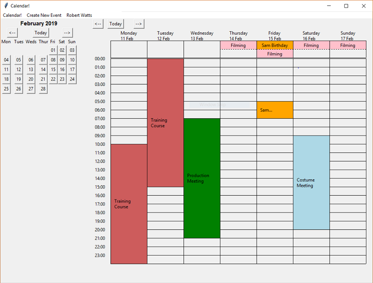

# Calendar App

**A offline Python Calendar app with user login**

For my A Level Computer Science controlled assessment I chose to create a Calendar App. In this project I had to:

* conduct user interviews and analyse existing products to help me generate a success criteria
* design the project with UML classes and designed the database
* create the application in python using a sutible development methodology
* evaluate the project to make sure that I had fufilled all of the success critera

Through this project I deepened my understanding of Python through learning new tools such as Tkinter and SQLite. This project helped me develop my written communication skills through the write up and project logs that had to be kept. I also learnt about the Agile Development methodology to help me keep on schedule. This helped my time management skills.

## Running the Project

To run the project just run the [Calendar.py](Calendar.py) file in the project root. The project is shipped with an empty database so on first run you will need to create a new account.

## Project Write Up

Throughout all of this I had to continually write up everything that I was doing, with screenshots and videos. This can be seen in the [write-up](write-up) folder. __For this project I received 84%.__ You can view the project write up [write-up/C03-Programming-Project.pdf](write-up/C03-Programming-Project.pdf).

